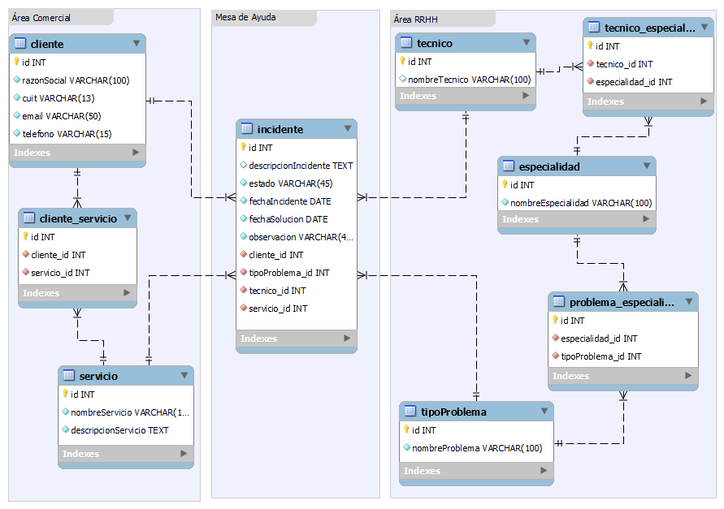

# Sistema de Reporte de Incidentes

Este proyecto tiene como objetivo el diseño y desarrollo de un sistema para la generación y seguimiento de incidentes en una empresa de soporte operativo. A continuación, se detallan los requerimientos del sistema y las entregas planificadas.

## Comision N° 120
## Integrantes Grupo N° 7:

   - Acosta Silvina Fernanda
   - Sanchez Diego Gerardo
   - Querol Nancy
   - Quiñonez Alejandro

## Requerimientos del Sistema

### Contexto General

La empresa brinda soporte operativo en distintas aplicaciones (SAP, Tango, etc.) y sistemas operativos (Windows, MacOS, Linux Ubuntu). Las áreas de RRHH, Comercial y Mesa de Ayuda tienen roles específicos en la gestión de incidentes.

### Ciclo de Vida de un Incidente

1. Cuando un cliente llama, la mesa de ayuda ingresa sus datos y muestra los servicios contratados.
2. El operador solicita información sobre el servicio y la descripción del incidente.
3. El sistema presenta una lista de técnicos disponibles y su tiempo estimado de resolución.
4. Confirmado el incidente, se notifica al técnico.
5. El técnico resuelve el incidente, marcándolo como "resuelto" y enviando una notificación al cliente.

### Otros Requerimientos

- RRHH emite reportes diarios de incidentes asignados a cada técnico.
- El operador puede agregar un "colchón" de horas estimadas para problemas "complejos".
- Alta de incidentes con problemas relacionados.
- Información sobre técnicos:
  - Quién resolvió más incidentes en los últimos N días.
  - Quién resolvió más incidentes de una especialidad específica en los últimos N días.
  - Quién resolvió los incidentes más rápidamente.

### Consideraciones

- Cada problema puede ser solucionado por una o varias especialidades.
- Los operadores pueden definir su tiempo estimado de resolución.
- Los técnicos pueden definir su medio preferido de notificación (Email o WhatsApp).

## Metodología

El proyecto se aborda mediante una metodología iterativa e incremental, dividido en tres entregas.

## Entregas:

### Entrega 1

En esta fase, nos enfocaremos en modelar, a nivel de datos y objetos, una solución al dominio presentado. Además, comenzaremos con la codificación de la solución. Se solicita:

1. Modelo de datos (DER físico) que brinde solución al dominio.

2. Código con modelado de clases. El proyecto Java se creará como un proyecto Maven, y se recomienda la utilización de Lombok para facilitar la generación de Setters y Getters.

### Entrega 2

En esta iteración, nos ocuparemos de mapear nuestras clases con anotaciones JPA para persistir el modelo en una Base de Datos Relacional. También generaremos repositorios y servicios para abordar algunos requerimientos. Se solicita:

1. Modelado de clases con mapeo (anotaciones JPA) de entidades para su persistencia mediante el ORM Hibernate.
2. Repositorios/Servicios que resuelvan requerimientos específicos:
   a. Quién fue el técnico con más incidentes resueltos en los últimos N días.
   b. Quién fue el técnico con más incidentes resueltos de una determinada especialidad en los últimos N días.
   c. Quién fue el técnico que más rápido resolvió los incidentes.